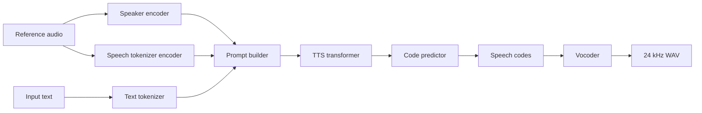

# qwen3-tts.cpp

Native C++17 / GGML inference for Qwen3-TTS.

`qwen3-tts.cpp` provides a local runtime for Qwen3-TTS: GGUF model loading,
text tokenization, speaker conditioning, autoregressive speech-code generation,
and 24 kHz waveform decoding without Python or PyTorch at inference time.

Windows with CUDA is the primary tested target. Linux uses the standard CMake
build path and the same GGML backend options.

## Desktop UI

If you prefer a graphical interface, [Qwen-TTS Studio](https://github.com/Danmoreng/qwen-tts-studio)
wraps this runtime in a desktop app with model management, voice presets,
voice cloning, backend selection, and Windows/Linux packaging.

## Features

- End-to-end Qwen3-TTS inference in C++17
- GGML backend integration with CPU and optional CUDA builds
- 0.6B and 1.7B Base model support
- 1.7B CustomVoice model support
- Voice cloning from reference WAV files
- ICL voice cloning with reference transcript and optional reference speech codes
- Reusable speaker embeddings in JSON or raw float32 binary format
- Reusable full-ICL voice prompts containing speaker embedding, transcript tokens, and reference speech codes
- Standalone speaker-embedding extraction with `--extract-speaker-embedding`
- Named CustomVoice speakers
- Style / instruction prompts where supported by the loaded model
- Language selection for `en`, `ru`, `zh`, `ja`, `ko`, `de`, `fr`, `es`, `it`, and `pt`
- Sampling controls: temperature, top-k, top-p, max tokens, repetition penalty
- GGUF quantization tooling for transformer weights, including Q8_0 and K-quant variants
- Native C++ API, C ABI, optional JNI target, and Kotlin wrapper sources
- WAV validation, regression-test scripts, trace dumps, and timing instrumentation

## Benchmarks

These numbers are local Windows CUDA measurements from the framework comparison
harness. They report the best-case warm generation path for each framework:
model load, process startup, reference trimming, speaker encoding, and voice
prompt construction are excluded where the framework exposes separate timers.
The primary metric is `RTF`, computed as generated audio duration divided by
`Generate+Decode` seconds. Higher is better.

Test setup:

- Windows, CUDA backend, NVIDIA GeForce RTX 5080 Laptop GPU 16 GB
- `max_tokens=128`, CPU threads set to physical cores, sampled decoding with temperature `0.9`,
  top-k `50`, top-p `1.0`, repetition penalty `1.05`
- Reference audio is trimmed to 5.95 s before benchmarking
- `qwen3-tts.cpp` uses a resident CLI repeat (`BenchmarkScope=session_repeat`)
  and the Q8_0 GGUF models from `%USERPROFILE%\.qwen-tts-studio\models`
- `faster-qwen3-tts` uses warm CUDA-graphs streaming with `chunk_size=8`
- `audio.cpp` uses one warm offline session with repeated requests and BF16
  weights; it does not expose the speaker-embedding-only path used in the first
  table, so that row is shown as `-`
- Serveurperso's CLI does not expose an equivalent resident repeat mode here;
  its rows use internal `TalkerDecode + CodecDecode` timers

### Speaker-Embedding Voice Clone

This is the lightweight voice-clone path: extract a speaker embedding once, then
generate from that embedding without prepending reference speech codes.

| Engine | 0.6B Generate+Decode | 0.6B RTF | 1.7B Generate+Decode | 1.7B RTF |
|--------|----------------------|---------|----------------------|---------|
| `qwen3-tts.cpp` GGUF Q8_0 | 0.794 s | 8.364 | 1.057 s | 6.741 |
| `ServeurpersoCom/qwentts.cpp` GGUF Q8_0 | 3.496 s | 2.291 | 2.810 s | 2.306 |
| `faster-qwen3-tts` HF BF16, warm CUDA graphs | 2.793 s | 2.779 | 2.845 s | 2.334 |
| `audio.cpp` | - | - | - | - |

### Full ICL Voice Clone

This is the heavier voice-clone path: encode/tokenize the reference audio and
prepend reference speech codes plus transcript context. The table still reports
only warm `Generate+Decode` time, not reference prompt construction.

| Engine | 0.6B Generate+Decode | 0.6B RTF | 1.7B Generate+Decode | 1.7B RTF |
|--------|----------------------|---------|----------------------|---------|
| `qwen3-tts.cpp` GGUF Q8_0 | 1.021 s | 10.027 | 1.456 s | 7.034 |
| `ServeurpersoCom/qwentts.cpp` GGUF Q8_0 | 4.257 s | 2.406 | 4.397 s | 2.329 |
| `faster-qwen3-tts` HF BF16, warm CUDA graphs | 3.796 s | 2.698 | 4.370 s | 2.343 |
| `audio.cpp` HF BF16, warm session | 4.754 s | 2.137 | 5.711 s | 1.783 |

The comparison harness is:

```powershell
$models = "$env:USERPROFILE\.qwen-tts-studio\models"

# Speaker-embedding voice clone.
.\scripts\benchmark_frameworks.ps1 -Implementations qwen_cpp,serveurperso `
  -Variant 1.7b-base -BenchmarkMode split -Runs 3 `
  -ReferenceMaxSec 5.95 -QwenCppModels $models -QwenCppSessionRepeats 2
.\scripts\benchmark_frameworks.ps1 -Implementations faster_python `
  -Variant 1.7b-base -BenchmarkMode split -Runs 3 `
  -ReferenceMaxSec 5.95 -FasterStreaming -FasterChunkSize 8 -FasterWarmupTokens 20
.\scripts\benchmark_frameworks.ps1 -Implementations qwen_cpp,serveurperso `
  -Variant 0.6b-base -BenchmarkMode split -Runs 3 `
  -ReferenceMaxSec 5.95 -QwenCppModels $models -QwenCppSessionRepeats 2
.\scripts\benchmark_frameworks.ps1 -Implementations faster_python `
  -Variant 0.6b-base -BenchmarkMode split -Runs 3 `
  -ReferenceMaxSec 5.95 -FasterStreaming -FasterChunkSize 8 -FasterWarmupTokens 20

# Full ICL path: reference transcript + reference speech codes are part of the workload.
.\scripts\benchmark_frameworks.ps1 -Implementations qwen_cpp,serveurperso,audio_cpp `
  -Variant 1.7b-base -BenchmarkMode full -Runs 3 `
  -ReferenceMaxSec 5.95 -QwenCppModels $models `
  -QwenCppSessionRepeats 2 -AudioCppSessionRepeats 2
.\scripts\benchmark_frameworks.ps1 -Implementations qwen_cpp,serveurperso,audio_cpp `
  -Variant 0.6b-base -BenchmarkMode full -Runs 3 `
  -ReferenceMaxSec 5.95 -QwenCppModels $models `
  -QwenCppSessionRepeats 2 -AudioCppSessionRepeats 2

# Faster CUDA-graphs streaming path. Report separately from process/CLI rows.
.\scripts\benchmark_frameworks.ps1 -Implementations faster_python `
  -Variant 1.7b-base -BenchmarkMode full -Runs 3 `
  -ReferenceMaxSec 5.95 -FasterStreaming -FasterChunkSize 8 -FasterWarmupTokens 20
.\scripts\benchmark_frameworks.ps1 -Implementations faster_python `
  -Variant 0.6b-base -BenchmarkMode full -Runs 3 `
  -ReferenceMaxSec 5.95 -FasterStreaming -FasterChunkSize 8 -FasterWarmupTokens 20
```

The raw and summary CSVs include `PromptMode`, `BenchmarkScope`,
`ModelFormat`, `Precision`, `GenerationSeconds`,
`RTF_AudioPerGeneration`, `ReferenceAudioSec`, and silence metrics. Use the
generation columns for best-case throughput. Keep Q8/GGUF rows separate from HF
FP16/BF16/F32 rows when publishing results.

## Quick Start

### Windows

```powershell
git clone https://github.com/Danmoreng/qwen3-tts.cpp.git
cd qwen3-tts.cpp
git submodule update --init --recursive

# CPU build
.\build.ps1 -UseNinja -Configuration Release

# CUDA build
.\build.ps1 -UseNinja -EnableCuda -Configuration Release
```

Create a Python environment for model download/conversion only:

```powershell
uv venv .venv
.\.venv\Scripts\Activate.ps1
uv pip install --upgrade pip
uv pip install huggingface_hub gguf torch safetensors numpy tqdm
```

Download and convert models:

```powershell
python .\scripts\setup_pipeline_models.py
python .\scripts\setup_1.7b_model.py
```

Run synthesis:

```powershell
.\build\qwen3-tts-cli.exe -m .\models `
  -t "Hello from qwen3-tts.cpp running locally." `
  -o .\examples\hello.wav
```

### Linux

Linux uses the standard CMake build path:

```bash
git clone https://github.com/Danmoreng/qwen3-tts.cpp.git
cd qwen3-tts.cpp
git submodule update --init --recursive

cmake -S . -B build -DCMAKE_BUILD_TYPE=Release
cmake --build build -j
```

For CUDA builds, enable the GGML CUDA backend:

```bash
cmake -S . -B build-cuda \
  -DCMAKE_BUILD_TYPE=Release \
  -DQWEN3_TTS_CUDA=ON \
  -DGGML_CUDA=ON
cmake --build build-cuda -j
```

Model setup is the same as on Windows:

```bash
uv venv .venv
source .venv/bin/activate
uv pip install --upgrade pip
uv pip install huggingface_hub gguf torch safetensors numpy tqdm

python scripts/setup_pipeline_models.py
python scripts/setup_1.7b_model.py
```

Run synthesis:

```bash
./build/qwen3-tts-cli \
  -m models \
  -t "Hello from qwen3-tts.cpp running locally." \
  -o examples/hello.wav
```

## Model Files

Ready-to-use GGUF files are available from
[`Serveurperso/Qwen3-TTS-GGUF`](https://huggingface.co/Serveurperso/Qwen3-TTS-GGUF).
Place the downloaded files under `models/`, or use the setup scripts to create
compatible GGUF files locally.

Typical files:

| File | Purpose |
|------|---------|
| `qwen-talker-0.6b-base-Q8_0.gguf` | 0.6B Base talker |
| `qwen-talker-1.7b-base-Q8_0.gguf` | 1.7B Base talker |
| `qwen-talker-1.7b-customvoice-Q8_0.gguf` | 1.7B CustomVoice talker |
| `qwen-tokenizer-12hz-Q8_0.gguf` | Speech tokenizer / vocoder |
| `qwen-talker-*-BF16.gguf` | BF16 talker variant, if generated |
| `qwen-talker-*-Q4_K_M.gguf` | K-quant talker variant, if generated |

Manual conversion:

```bash
huggingface-cli download Qwen/Qwen3-TTS-12Hz-0.6B-Base \
  --local-dir models/Qwen3-TTS-12Hz-0.6B-Base

python scripts/convert_tts_to_gguf.py \
  --input models/Qwen3-TTS-12Hz-0.6B-Base \
  --output models/qwen-talker-0.6b-base-Q8_0.gguf \
  --type q8_0

python scripts/convert_tokenizer_to_gguf.py \
  --input models/Qwen3-TTS-12Hz-0.6B-Base \
  --output models/qwen-tokenizer-12hz-Q8_0.gguf \
  --type q8_0
```

Quantize a converted transformer GGUF:

```bash
./build/qwen3-tts-quantize \
  models/qwen-talker-1.7b-base-F32.gguf \
  models/qwen-talker-1.7b-base-Q8_0.gguf \
  q8_0
```

Supported output policies include `bf16`, `q8_0`, `q4_k`, `q4_k_m`,
`q5_k_m`, `q6_k`, and lower-bit K-quant variants.

## Usage

Basic synthesis:

```bash
./build/qwen3-tts-cli -m models \
  -t "Hello, world!" \
  -o hello.wav
```

Select a specific model:

```bash
./build/qwen3-tts-cli -m models \
  --model-name qwen-talker-1.7b-base-Q8_0.gguf \
  -t "The selected model is now running." \
  -o selected.wav
```

Base talkers can synthesize without `--reference`, `--speaker`, or
`--speaker-embedding`. Supplying a reference or embedding conditions the voice;
omitting it uses the model's unconditioned Base prompt.

Voice cloning from reference audio:

```bash
./build/qwen3-tts-cli -m models \
  -r reference.wav \
  -t "This should follow the reference voice." \
  -o cloned.wav
```

ICL voice cloning with a reference transcript:

```bash
./build/qwen3-tts-cli -m models \
  -r reference.wav \
  --reference-text "Transcript of the reference audio." \
  -t "This uses the reference transcript as an acoustic prompt." \
  -o cloned_icl.wav
```

Extract a reusable full-ICL prompt and synthesize from it later:

```bash
./build/qwen3-tts-cli -m models \
  -r reference.wav \
  --reference-text "Transcript of the reference audio." \
  --extract-icl-prompt voice_prompt.json

./build/qwen3-tts-cli -m models \
  --icl-prompt voice_prompt.json \
  -t "This run reuses the full ICL acoustic prompt." \
  -o cloned_from_icl_prompt.wav
```

The saved ICL prompt includes the speaker embedding, tokenized reference
transcript, and reference speech codes. Later synthesis skips reference-audio
encoding and reports `Speaker encode: 0 ms`.

Extract a speaker embedding and synthesize from it later:

```bash
./build/qwen3-tts-cli -m models \
  -r reference.wav \
  --extract-speaker-embedding speaker.json

./build/qwen3-tts-cli -m models \
  --speaker-embedding speaker.json \
  -t "This run skips reference-audio speaker encoding." \
  -o cloned_from_embedding.wav
```

CustomVoice speaker:

```bash
./build/qwen3-tts-cli -m models \
  --model-name qwen-talker-1.7b-customvoice-Q8_0.gguf \
  --speaker vivian \
  --instruct "Whispering, very soft and quiet voice." \
  -t "This is a styled CustomVoice example." \
  -o styled.wav
```

Reproducible sampled decoding:

```bash
./build/qwen3-tts-cli -m models \
  -t "Hello!" \
  --temperature 0.9 \
  --top-k 50 \
  --top-p 1.0 \
  --seed 42 \
  --max-tokens 256 \
  -o seeded.wav
```

`--temperature 0` enables greedy argmax decoding. It is useful for low-level
debugging and reference comparisons, but speaker-embedding-only synthesis can
collapse to near-silent repeated speech codes with greedy decoding. For user
facing audio, prefer seeded sampling when reproducibility is needed.

## CLI Options

| Flag | Description | Default |
|------|-------------|---------|
| `-m, --model <dir>` | Directory containing GGUF model files | Required |
| `--model-name <file>` | Select a specific TTS GGUF in `--model` | Auto-detect |
| `-t, --text <text>` | Text to synthesize | Required except extraction mode |
| `-o, --output <file>` | Output WAV path | `output.wav` |
| `-r, --reference <file>` | Reference WAV for voice cloning | None |
| `--reference-text <text>` | Reference transcript for ICL voice cloning | None |
| `--reference-text-file <file>` | Read ICL transcript from a file | None |
| `--reference-token-ids <file>` | Reference prompt token IDs | None |
| `--reference-codes <file>` | Reference speech codes as text or JSON integers | None |
| `--icl-prompt <file>` | Reuse a saved full-ICL voice prompt | None |
| `--speaker <name>` | Named CustomVoice speaker | None |
| `--speaker-embedding <file>` | Reuse saved speaker embedding | None |
| `--dump-speaker-embedding <file>` | Save embedding while running synthesis from `--reference` | None |
| `--extract-speaker-embedding <file>` | Extract speaker embedding from `--reference` and exit | None |
| `--extract-icl-prompt <file>` | Extract full-ICL prompt from `--reference` plus transcript and exit | None |
| `--dump-generated-codes <file>` | Save generated speech codes | None |
| `--dump-decoder-codes <file>` | Save vocoder-input speech codes | None |
| `--temperature <value>` | Sampling temperature; `0` means greedy | `0.9` |
| `--top-k <n>` | Top-k sampling; `0` disables it | `50` |
| `--top-p <value>` | Top-p sampling parameter | `1.0` |
| `--max-tokens <n>` | Maximum generated audio frames | `4096` |
| `--repeat <n>` | Repeat synthesis in one loaded process | `1` |
| `--repetition-penalty <value>` | Repetition penalty | `1.05` |
| `-l, --language <lang>` | `en ru zh ja ko de fr es it pt` | `en` |
| `--instruction`, `--instruct` | Style / voice instruction prompt | None |
| `-j, --threads <n>` | CPU thread count | physical cores |

`--reference`, `--speaker`, `--speaker-embedding`, and `--icl-prompt` are
mutually exclusive speaker-conditioning modes.

## Architecture



Major runtime components:

| Component | Files | Role |
|-----------|-------|------|
| Text tokenizer | `src/text_tokenizer.*`, `src/tokenizer_unicode.*` | BPE tokenization |
| Speaker encoder | `src/audio_tokenizer_encoder.*`, `src/encoder/*` | Reference audio to speaker embedding |
| Speech tokenizer encoder | `src/speech_tokenizer_encoder.*` | Reference audio to speech codes for ICL/debugging |
| Transformer | `src/tts_transformer.*`, `src/transformer/*` | Talker and code-predictor generation |
| Vocoder | `src/audio_tokenizer_decoder.*`, `src/decoder/*` | Speech codes to waveform |
| Pipeline | `src/qwen3_tts.*`, `src/pipeline/*` | End-to-end orchestration, caching, timing |
| CLI | `src/main.cpp` | Command-line frontend |
| C API / JNI | `src/qwen3_tts_c.*`, `src/qwen3_tts_jni.cpp` | Native integration surface |

## Native APIs

The CLI is one frontend. The repository also exposes:

- C++ API: `qwen3_tts::Qwen3TTS` in `src/qwen3_tts.h`
- C ABI: `src/qwen3_tts_c.h`
- Optional JNI shared library with `-DQWEN3_TTS_BUILD_SHARED=ON`
- Kotlin Multiplatform wrapper sources under `shared/`

The C++/C/JNI/Kotlin surfaces include full-ICL prompt preparation and reuse:
load the prompt encoders with `load_icl_prompt_encoder_only` /
`qwen3_tts_load_icl_prompt_encoder` /
`loadIclPromptEncoder`, create a prompt with `extract_icl_prompt` /
`qwen3_tts_extract_icl_prompt` / `extractIclPrompt`, then synthesize with
`synthesize_with_speaker_embedding` plus the prompt fields or the convenience
C/JNI/Kotlin `synthesizeWithIclPrompt` helpers.

Build the JNI target:

```bash
cmake -S . -B build-shared -DQWEN3_TTS_BUILD_SHARED=ON
cmake --build build-shared -j
```

## Build Options

Common CMake options:

| Option | Purpose |
|--------|---------|
| `QWEN3_TTS_CUDA` | Enable GGML CUDA integration |
| `QWEN3_TTS_TIMING` | Enable detailed timing logs |
| `QWEN3_TTS_BUILD_SHARED` | Build optional JNI shared library |
| `QWEN3_TTS_EMBED_GGML` | Build GGML as a CMake subdirectory |
| `QWEN3_TTS_GGML_DIR` | Path to the GGML source tree |

Windows helper examples:

```powershell
.\build.ps1 -Configuration Release
.\build.ps1 -UseNinja -EnableCuda -EnableTiming -Configuration Release
```

CMake examples:

```bash
cmake -S . -B build -DCMAKE_BUILD_TYPE=Release
cmake --build build -j

cmake -S . -B build-timing \
  -DCMAKE_BUILD_TYPE=Release \
  -DQWEN3_TTS_TIMING=ON
cmake --build build-timing -j
```

Low-memory mode can be enabled at runtime:

```bash
QWEN3_TTS_LOW_MEM=1 ./build/qwen3-tts-cli -m models -t "Hello" -o hello.wav
```

Runtime performance toggles:

| Variable | Purpose |
|----------|---------|
| `QWEN3_TTS_CODE_PRED_REPLAY_GRAPHS=0` | Disable default Code Predictor replay graphs for backend or memory diagnostics |
| `QWEN3_TTS_TALKER_REPLAY_GRAPHS=0` | Disable default Talker step replay graphs for backend or memory diagnostics |
| `QWEN3_TTS_CODE_PRED_ZERO_KV=1` | Restore legacy per-frame physical Code Predictor KV zeroing for parity diagnostics; by default each live row is overwritten before reuse |
| `QWEN3_TTS_CODE_PRED_PACKED_QKV=0` | Disable the CUDA packed Code Predictor step QKV projection and restore separate Q, K, and V matmuls |
| `QWEN3_TTS_CODE_PRED_SUPERGRAPH=0` | Disable the automatic greedy CUDA Code Predictor supergraph for diagnostics and restore the established 15-graph path |
| `QWEN3_TTS_CODE_PRED_DEVICE_CHAIN=0` | Disable the older multi-graph device-token bridge as well; this only affects the fallback used when the supergraph is disabled |
| `QWEN3_TTS_TALKER_PACKED_QKV=0` | Disable the CUDA packed Talker step QKV projection used by models wider than 1024 and restore separate Q, K, and V matmuls |
| `QWEN3_TTS_DECODER_SUM_REST_EMBEDDINGS=0/1` | Force the legacy/summed decoder rest-codebook projection; automatic mode uses the summed CUDA path only for inputs up to 63 frames |

## Testing and Debugging

Windows regression runner:

```powershell
.\scripts\run_all_tests.ps1 -Configuration Release
```

POSIX test runner:

```bash
bash scripts/run_all_tests.sh
```

Useful debugging tools:

| Tool | Purpose |
|------|---------|
| `scripts/prepare_test_assets.ps1` | Generate or refresh deterministic reference assets |
| `scripts/compare_e2e.py` | End-to-end Python vs C++ comparison |
| `scripts/validate_device_chain_python.ps1` | Gate automatic optimized vs legacy C++ byte identity and compare 0.6B/1.7B Q8, F16/BF16, and F32 against official float32 Python |
| `scripts/dump_python_trace.py` | Dump Python logits/tokens for frame-level debugging |
| `scripts/debug_trace_report.py` | Compare trace directories |
| `scripts/wav_stats.ps1` | Validate WAV duration, peak, RMS, and silence checks |
| `test_decoder --bench-warmup 2 --bench-runs 10` | Run resident, fixed-code decoder measurements with machine-readable timing output |
| `QWEN3_TTS_DEBUG_DUMP_DIR` | Enable C++ frame/code trace dumps |
| `QWEN3_TTS_DEBUG_DUMP_MAX_FRAMES` | Limit dumped generation frames |
| `QWEN3_TTS_DEBUG_DUMP_MAX_CODE_STEPS` | Limit dumped code-predictor steps |

The Code Predictor parity workflow reuses one official Python model load, feeds
the resulting Python speaker embedding to C++, and reports token, audio,
dispatch, and optional resident performance metrics:

```powershell
.\scripts\validate_device_chain_python.ps1 -IncludePrecisionModels `
  -Lengths 32,64,96 `
  -BenchmarkWarmups 2 -BenchmarkRuns 5
```

Schema-3 reports record repository and Python revisions, the Hugging Face
snapshot/config hash, binary/model/codec hashes, relevant optimization
environment variables, the observed transformer backend/hidden size, and
whether the automatic supergraph or older device-chain fallback was selected.
`-RequireExactPythonCodes` requires the complete Python trajectory to match;
the known single extra C++ `max_tokens` frame is reported separately instead
of being silently treated as Python output.

Precision models are local test assets and are not committed. Generate missing
0.6B F16/F32 GGUF files with `scripts/convert_tts_to_gguf.py --type f16` or
`--type f32` before using `-IncludePrecisionModels`.

The historical 1.7B exact-parity gate uses the saved Python ICL prompt
artifacts, F32 GGUF files, and deterministic top-k-1 decoding:

```powershell
.\scripts\validate_device_chain_python.ps1 -ModelSize 1.7B `
  -CppModels qwen-talker-1.7b-base-F32.gguf `
  -CodecModel "$env:USERPROFILE\.qwen-tts-studio\models\qwen-tokenizer-12hz-F32.gguf" `
  -PromptMode icl -DecodeMode topk1 -RequireExactPythonCodes `
  -PythonSpeakerEmbedding benchmark_output\python_parity\python_speaker_embedding.json `
  -PythonReferenceCodes benchmark_output\python_parity\python_reference_codes.json `
  -ReferenceTextFile benchmark_output\parity_serveurperso_seed\ref.txt `
  -Text "This is a short parity check for ICL voice cloning." -Lengths 64
```

The prompt paths in that historical command are deliberately ignored local
artifacts, so it is not yet a clean-checkout CI gate. Supply prompt artifacts
generated from the intended reference audio/transcript (or point the command
at equivalent local files); the report hashes and revisions make the resulting
run auditable. Promoting a compact prompt fixture to tracked/nightly coverage
remains an open development-plan item.

Example trace run:

```powershell
$env:QWEN3_TTS_DEBUG_DUMP_DIR = ".\trace_cpp"
$env:QWEN3_TTS_DEBUG_DUMP_MAX_FRAMES = "2"
$env:QWEN3_TTS_DEBUG_DUMP_MAX_CODE_STEPS = "15"

.\build\qwen3-tts-cli.exe -m .\models `
  --model-name qwen-talker-1.7b-base-Q8_0.gguf `
  -t "Hello." `
  --temperature 0 `
  --top-k 0 `
  --max-tokens 64 `
  -o trace.wav

python .\scripts\debug_trace_report.py --trace-a .\trace_cpp
```

## Acknowledgments

- Original fork base: [`predict-woo/qwen3-tts.cpp`](https://github.com/predict-woo/qwen3-tts.cpp)
- Qwen3-TTS models by the [Alibaba Qwen team](https://huggingface.co/Qwen)
- Simon Quinn / ServeurpersoCom for [`qwentts.cpp`](https://github.com/ServeurpersoCom/qwentts.cpp)
  and ready-to-use GGUF releases at
  [`Serveurperso/Qwen3-TTS-GGUF`](https://huggingface.co/Serveurperso/Qwen3-TTS-GGUF)
- [GGML](https://github.com/ggml-org/ggml), the tensor/runtime foundation used by this project
- The wider llama.cpp / GGML community for backend, quantization, and runtime ideas

## License

This project's source code is released under the MIT License. See
[`LICENSE`](LICENSE).

Please review bundled dependency licenses and the Qwen3-TTS model licenses
before redistributing dependencies, model files, or generated artifacts.
